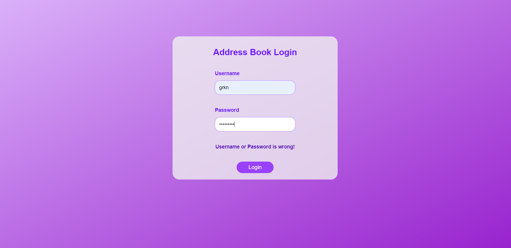
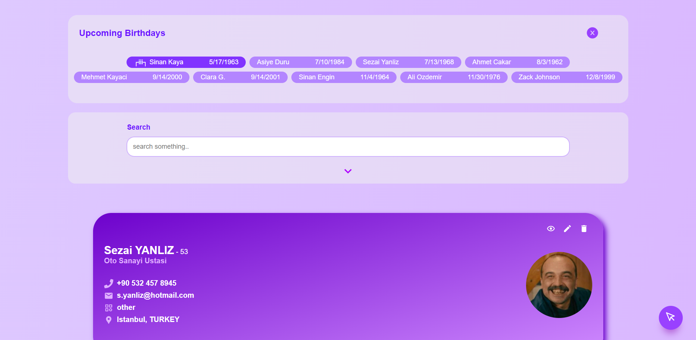
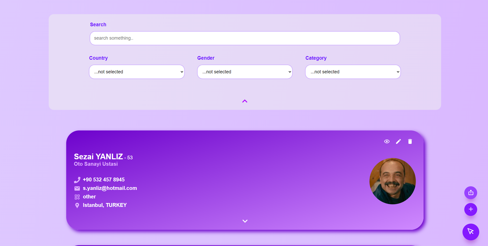
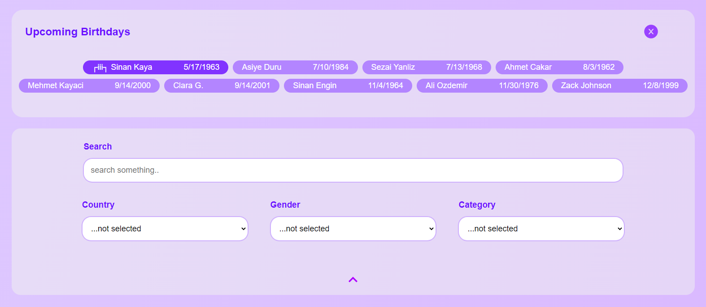
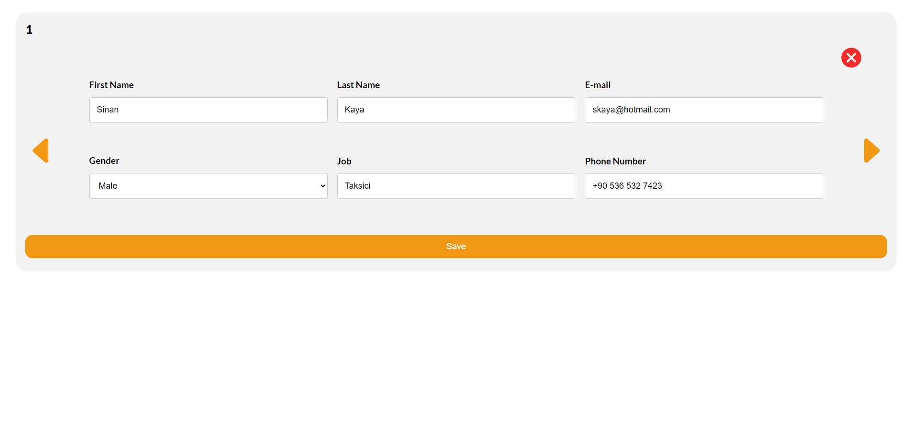
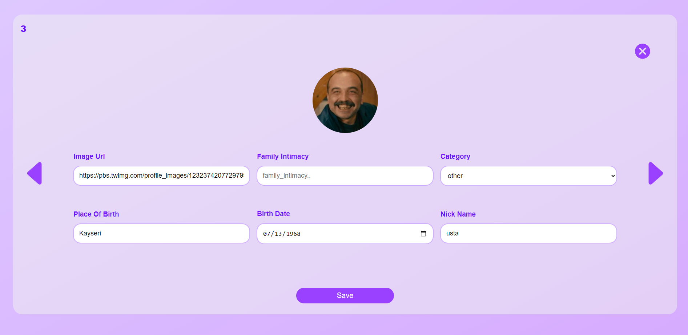
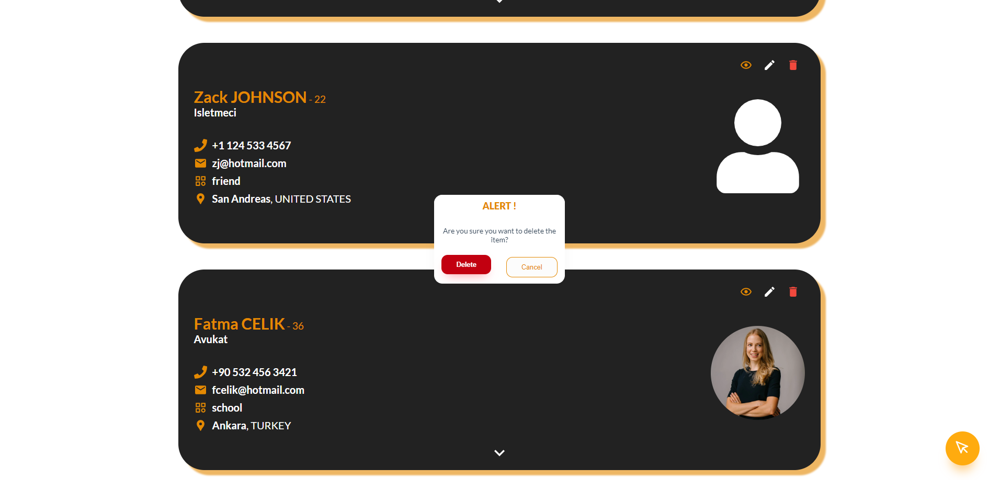
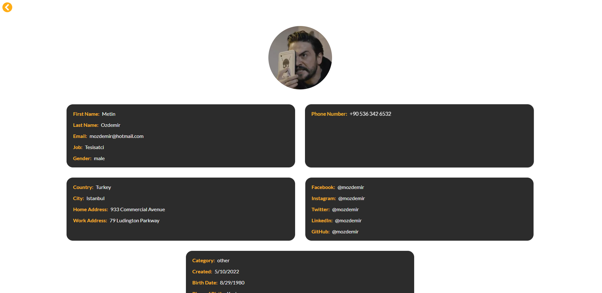
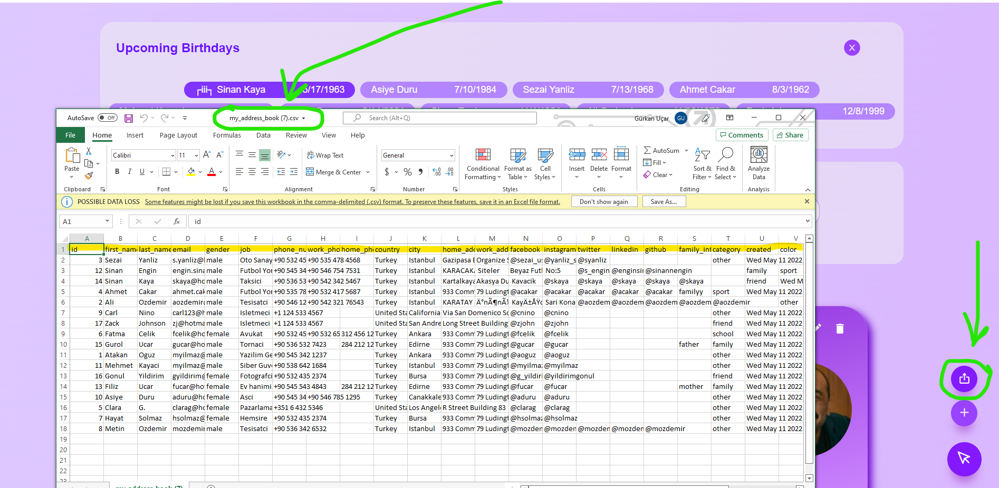

# Address Book React - Final Project

#### Gurkan UCAR

#### Trakya University, Computer Engineering

&nbsp;

## Slide

[https://github.com/gurkanucar/address-book-project/raw/master/1191602003-address-book-slide.pptx](https://github.com/gurkanucar/address-book-project/raw/master/1191602003-address-book-slide.pptx)

## Live Demo

[https://address-book.gurkanucar.com](https://address-book.gurkanucar.com)

#### User credentials for testing

```bash
   username: grkn
   password: pass
```

## Used Packages

**Redux:** for global state management

**Formik:** it helps to manage multiple inputs in form

**Yup:** for validation schemas

**React Icons:** there are many icons in this package

**React Router:** You can navigate your pages using this package

&nbsp;

## How to run

#### clone the project: https://github.com/gurkanucar/address-book-project.git

```bash
  git clone https://github.com/gurkanucar/address-book-project.git
  cd address-book-project
```

#### install the packages

```bash
  npm install
```

#### run

```bash
  npm start
```

#### User credentials for testing

```bash
   username: grkn
   password: pass
```

## Example Images




















