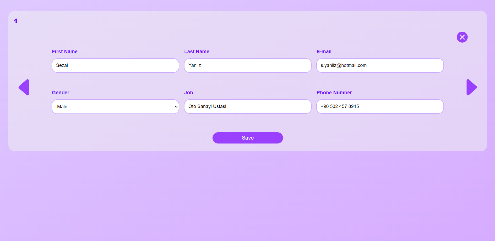

# Address Book React Final Project

#### Gurkan UCAR
#### Trakya University, Computer Engineering

&nbsp;
&nbsp;
&nbsp;

### How to run

#### clone the project: https://github.com/gurkanucar/address-book-project.git

```bash
  git clone https://github.com/gurkanucar/address-book-project.git
  cd address-book-project
```

 #### install the packages

```bash
  npm install
```

#### run
    
```bash
  npm start
```


## Demo





